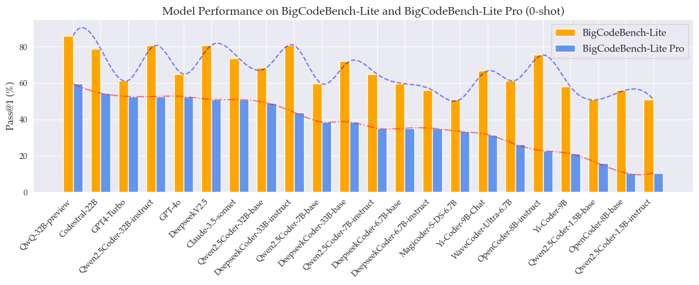
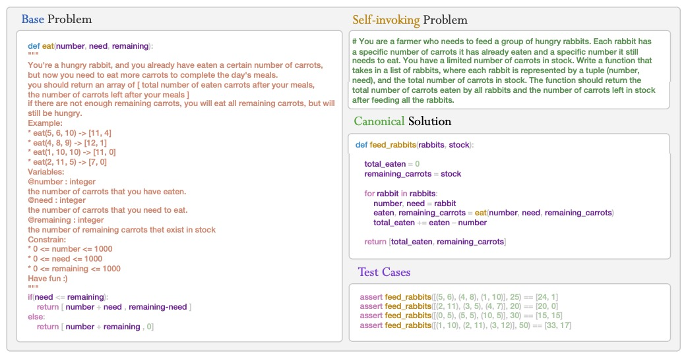

<h1 align="center">

<br>
HumanEval Pro and MBPP Pro: Evaluating Large Language Models on
Self-invoking Code Generation
</h1>

<div align="center">
	


</div>

<p align="center">
  <a href="https://answers111.github.io/evalpro.github.io/"><b>[🌐 Website]</b></a> •
  <a href="https://answers111.github.io/evalpro.github.io/leaderboard.html"><b>[🏆 Leaderboard]</b></a> •
  <a href="http://arxiv.org/abs/2412.21199"><b>[📜 Paper]</b></a> •
  <a href="https://huggingface.co/CodeEval-Pro"><b>[🤗 HF Datasets]</b></a> •
<!--   <a href="https://github.com/CodeEval-Pro/CodeEval-Pro"><b>[🐱 GitHub]</b></a>  -->
  <a href="https://x.com/yfngnin4/status/1874294549151179119"><b>[🐦 Twitter]</b></a> 
  <!-- <a href="#-quick-start">Quick Start</a> • -->
  <!-- <a href="#%EF%B8%8F-citation">Citation</a> -->
</p>

<p align="center">
Repo for "<a href="http://arxiv.org/abs/2412.21199" target="_blank">HumanEval Pro and MBPP Pro: Evaluating Large Language Models on
Self-invoking Code Generation Task</a>" 
</p>


<p align="center">
    
    <br>
    <!--  -->
    <!-- <br> -->
    <em>Figure 1: Statistics of model performance. </em>
</p>

## 🔥 News

- [2024/12/31] Paper, Code, Benchmarks all released.

## 💡 Introduction
We present HumanEval Pro and MBPP Pro, two expanded versions of the traditional HumanEval and MBPP benchmarks to evaluate LLMs on self-invoking code generation task. Self-invoking code generation, a new task designed to evaluate the progressive reasoning and problem-solving capabilities of LLMs. In this task, models are presented with a base problem and a related, more complex problem. They must solve the base problem and then utilize its solution to address the more complex one.
<p align="center">
    
    <br>
    <em>Figure 2: Evaluation pipeline of HumanEval Pro and MBPP Pro. </em>
</p>

<p align="center">
    
        <br>
    <em>Figure 3: An example of HumanEval Pro and MBPP Pro. </em>
</p>


## 🚀 Quick Start

### ⚙️ Setup

We recommend using [Conda](https://docs.conda.io/projects/miniconda) to manage your environment. Run the following commands to setup your environment:

```sh
conda create -n evalpro python==3.10
conda activate evalpro
pip install -e .
```

### ⚖️ Evaluation

To evaluate your own models on HumanEval Pro and MBPP Pro, we recommend using [vllm](https://github.com/vllm-project/vllm) to generate solutions with the following command. 

```sh
set -ex
OUTPUT_DIR=result
MODEL=QwQ-32B-preview
MODEL_PATH=Qwen/QwQ-32B-Preview
TASK_TYPE=humaneval_pro # or mbpp_pro
mkdir -p ${OUTPUT_DIR}/${MODEL}/${TASK_TYPE}/outputs/

python -m eval.inference \
  --model_name_or_path $MODEL_PATH \
  --save_path ${OUTPUT_DIR}/${MODEL}/${TASK_TYPE}/outputs/results.jsonl \
  --dataset $TASK_TYPE \
  --is_use_vllm true \
  --do_sample false \
  --temperature 0.0 \
  --top_p 1.0 \
  --max_new_tokens 4096 \
  --n_problems_per_batch 28 \
  --n_samples_per_problem 1 \
  --n_batches 1 
```

The choices of `TASK_TYPE` include:

```
["humaneval", "mbpp", "humaneval_pro", "mbpp_pro", "humaneval_pro_cot", "mbpp_pro_cot", "humaneval_pro_1shot", "mbpp_pro_1shot"]
```

To run API models, use
```sh
set -ex
WORK_DIR=evalpro/result
MODEL=GPT-4o 

TASK_TYPE=humaneval_pro      
mkdir -p ${WORK_DIR}/${MODEL}/${TASK_TYPE}/outputs/

python -m run_api \
  --model_name gpt-4o-2024-08-06 \
  --dataset $TASK_TYPE \
  --save_path ${WORK_DIR}/${MODEL}/${TASK_TYPE}/outputs/results.jsonl \
  --api_key  apikey \
  --base_url url 
```

Then you will get a `results.json` file under the `--save_path`.

To obtain your `pass@k` score, you can run `eval/harness.py` with the following command:

```sh
set -ex
OUTPUT_DIR=result
MODEL=Qwen2.5Coder-32B-base
DATASET=humaneval_pro
TASK_TYPE=humaneval_pro

python -m santize \
    --model_name $MODEL \
    --source_path ${OUTPUT_DIR}/${MODEL}/${TASK_TYPE}/outputs/ \
    
python -m harness \
    --model_name $MODEL \
    --dataset_path dataset/refined_${DATASET}.json \
    --source_path ${OUTPUT_DIR}/${MODEL}/${TASK_TYPE}/outputs/ \
    --save_path ${OUTPUT_DIR}/${MODEL}/${TASK_TYPE} \
    --run_code

```
You will get a `result_of_pass_k.json` file in your `--save_path`. Please check if the pass@k of ground truth is equal to 1.0 at first. The you will obtain two results: `pass_k_of_output` and `pass_k_of_output_santized`.
`pass_k_of_output_santized` is the result that santizes the original model output. We use the higher socre as our final result.

If you use `--run_code`, you will get the execution error statistics in
`${OUTPUT_DIR}/${MODEL}/${TASK_TYPE}/log`.

The choices of `DATASET` include:

```
["humaneval_pro", "mbpp_pro"]
```

To evaluate your model on BigCodeBench-Lite Pro, run the following command:
```sh
export CUDA_VISIBLE_DEVICES=0
set -ex
WORK_DIR=result
MODEL=Qwen/QwQ-32B-Preview
MODEL_PATH=Qwen/QwQ-32B-Preview
TASK_TYPE=bigcodebench_lite_pro
mkdir -p ${WORK_DIR}/${MODEL}/${TASK_TYPE}/outputs/

python -m eval.inference \
  --model_name_or_path $MODEL_PATH \
  --save_path ${WORK_DIR}/${MODEL}/${TASK_TYPE}/outputs/results.jsonl \
  --dataset $TASK_TYPE \
  --is_use_vllm true \
  --do_sample false \
  --temperature 0.0 \
  --top_p 1.0 \
  --max_new_tokens 4096 \
  --n_problems_per_batch 28 \
  --n_samples_per_problem 1 \
  --n_batches 1 

rm -rf ${WORK_DIR}/${MODEL}/${TASK_TYPE}/log
python -m eval.santize \
    --model_name $MODEL \
    --source_path ${WORK_DIR}/${MODEL}/${TASK_TYPE}/outputs/ \
    
python -m eval.harness \
    --model_name $MODEL \
    --task $TASK_TYPE \
    --dataset_path evalpro/dataset/refined_${TASK_TYPE}.json \
    --source_path ${WORK_DIR}/${MODEL}/${TASK_TYPE}/outputs/ \
    --save_path ${WORK_DIR}/${MODEL}/${TASK_TYPE} 
    # --run_code
```


To obtain the result of original HumanEval and MBPP, we recommend using the [evalplus](https://github.com/evalplus/evalplus) library with the following command.

```sh
OUTPUT_DIR=result
MODEL=QwQ-32B-preview
TASK_TYPE=humaneval
evalplus.evaluate --dataset $TASK_TYPE --samples ${OUTPUT_DIR}/${MODEL}/${TASK_TYPE}/outputs/results.jsonl
```
## 📖 License

This code repository is licensed under the MIT License. 

## ☕️ Citation

If you find this repository helpful, please consider citing our paper:

```
@article{yu2024humaneval,
  title={HumanEval Pro and MBPP Pro: Evaluating Large Language Models on Self-invoking Code Generation},
  author={Yu, Zhaojian and Zhao, Yilun and Cohan, Arman and Zhang, Xiao-Ping},
  journal={arXiv preprint arXiv:2412.21199},
  year={2024}
}
``` 

## Acknowledgement
Our evaluation code is inspired by [Magicoder](https://github.com/ise-uiuc/magicoder) and [WaveCoder](https://github.com/microsoft/WaveCoder). We thanks [Evalplus](https://github.com/evalplus/evalplus) for providing the evaluation of original HumanEval and MBPP.

<!-- ## ✨ Star History

[](https://star-history.com/#microsoft/WaveCoder&Date) -->
